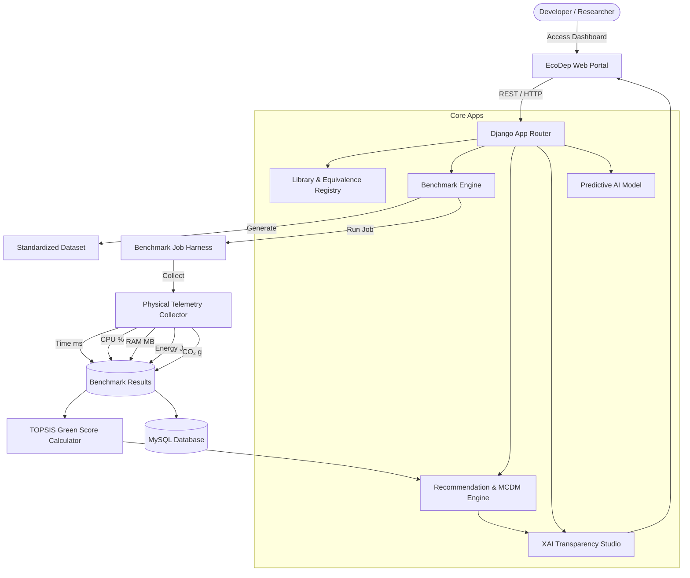
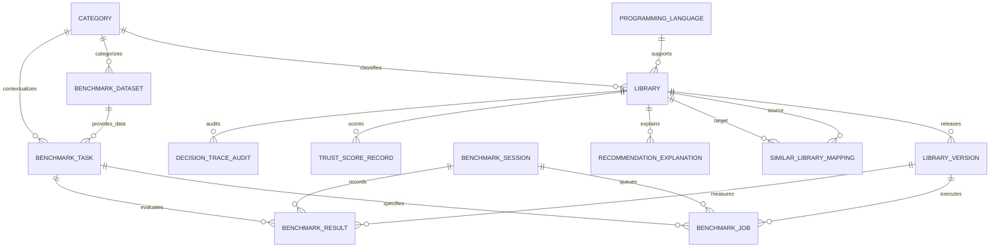

# EcoDep – Green Library Recommender

> **An energy-aware software dependency benchmarking and recommendation system for identifying greener functionally equivalent libraries.**


---

## 📋 Table of Contents

1. [Project Overview](#-project-overview)
2. [Research Motivation](#-research-motivation)
3. [Problem Statement](#-problem-statement)
4. [Research Objectives](#-research-objectives)
5. [Research Questions](#-research-questions)
6. [Proposed Solution](#-proposed-solution)
7. [System Architecture](#-system-architecture)
8. [End-to-End Workflow Pipeline](#-end-to-end-workflow-pipeline)
9. [Core System Modules](#-core-system-modules)
   - [Library Management & Equivalence Mapping](#1-library-management--equivalence-mapping)
   - [Standardized Dataset & Workload Task System](#2-standardized-dataset--workload-task-system)
   - [Benchmark Execution Engine & Job Telemetry](#3-benchmark-execution-engine--job-telemetry)
   - [Performance, Energy, and CO₂ Metrics](#4-performance-energy-and-co₂-metrics)
   - [Green Score & TOPSIS MCDM Algorithm](#5-green-score--topsis-mcdm-algorithm)
   - [Sustainability Recommendation Engine](#6-sustainability-recommendation-engine)
   - [Explainable AI (XAI) & Transparency Studio](#7-explainable-ai-xai--transparency-studio)
   - [Predictive AI Sustainability Inference](#8-predictive-ai-sustainability-inference)
   - [Carbon-Aware Intelligence](#9-carbon-aware-intelligence)
   - [Automated Publication & IEEE Report Generator](#10-automated-publication--ieee-report-generator)
10. [Supported Library Categories](#-supported-library-categories)
11. [Technology Stack](#-technology-stack)
12. [System Requirements](#-system-requirements)
13. [Project Directory Structure](#-project-directory-structure)
14. [Database Design & Key Entities](#-database-design--key-entities)
15. [Installation & Setup Guide](#-installation--setup-guide)
16. [Environment Configuration](#-environment-configuration)
17. [Running the Application](#-running-the-application)
18. [Executing Benchmark Experiments](#-executing-benchmark-experiments)
19. [Research Reproducibility & Experimental Controls](#-research-reproducibility--experimental-controls)
20. [Benchmark Result Interpretation](#-benchmark-result-interpretation)
21. [Limitations](#-limitations)
22. [Future Scope](#-future-scope)
23. [Automated Testing](#-automated-testing)
24. [Security Considerations](#-security-considerations)
25. [License](#-license)
26. [Authors & Citation](#-authors--citation)
27. [Acknowledgements](#-acknowledgements)

---

## 📌 Project Overview

**EcoDep** is a scientific benchmarking, energy-aware measurement, and multi-criteria dependency recommendation platform. Modern software engineering relies heavily on third-party open-source libraries (e.g., JSON parsers, HTTP clients, ORMs, logging tools, caching engines). While developers traditionally evaluate candidate libraries based on functional requirements, API convenience, or community popularity, the **energy consumption**, **hardware CPU/RAM footprint**, and **Scope 2 carbon emissions** of third-party dependencies remain invisible during dependency selection.

EcoDep addresses this critical gap by executing candidate dependencies under standardized, reproducible workloads, measuring granular resource and energy telemetry, and applying Multi-Criteria Decision Making (MCDM TOPSIS) to guide developers toward greener software architecture choices.

---

## 🔬 Research Motivation

1. **Invisible Environmental Footprint:** Millions of microservice instances execute open-source libraries continuously in cloud datacenters. Micro-efficiencies at the dependency level compound into megawatt-hours of electrical grid consumption.
2. **Missing Sustainability Metrics in Package Managers:** Ecosystems such as PyPI, npm, and Maven index popularity, versions, and security vulnerabilities, but provide zero visibility into runtime energy efficiency or carbon intensity.
3. **Multi-Metric Trade-offs:** A library with low CPU latency may consume higher peak RAM or draw elevated power under sustained throughput. EcoDep provides balanced decision-making through normalized multi-criteria weighting.

---

## 🎯 Problem Statement

Existing dependency selection mechanisms focus strictly on technical compatibility, popularity, and basic throughput. Software engineers lack a standardized, reproducible, and explainable methodology to compare the energy consumption and carbon emissions of functionally equivalent open-source libraries under identical workloads. EcoDep solves this by establishing a controlled benchmark harness, physical telemetry collection pipeline, TOPSIS Green Score ranking engine, and Explainable AI (XAI) recommendation dashboard.

---

## 🏁 Research Objectives

1. **Functional Equivalence Mapping:** Model domain-specific functional equivalence across third-party candidate packages.
2. **Standardized Synthetic Datasets:** Generate deterministic, reproducible payload datasets (JSON, CSV, XML, Text, Raster Image) with fixed random seeds.
3. **Controlled Workload Execution:** Execute candidate libraries within isolated benchmark jobs configured with warmup runs and iteration loops.
4. **Physical & Model Telemetry Measurement:** Measure execution time (ms), CPU load (%), peak RAM RSS (MB), energy consumption (Joules), and estimated CO₂ emissions (g).
5. **Multi-Criteria Optimization (Green Score):** Apply TOPSIS (Technique for Order of Preference by Similarity to Ideal Solution) and AHP to normalize cost criteria and compute an objective Green Score (0–100).
6. **Persona-Tailored Recommendation Engine:** Deliver dependency recommendations tailored to Software Developer, ESG Sustainability Manager, and Infrastructure Lead personas.
7. **Explainable AI & Audit Lineage:** Provide SHAP feature attributions, Why-Not contrastive analysis, SHA-256 cryptographic audit traces, and empirical Trust Scoreboards.
8. **Predictive AI Inference:** Infer sustainability metrics for unbenchmarked libraries using Ridge Regression feature Store models.

---

## ❓ Research Questions

- **RQ1:** Do functionally equivalent software libraries exhibit statistically significant differences in energy consumption under identical workloads?
- **RQ2:** How do execution latency, CPU utilization, and memory footprint correlate with total Joules drawn during execution?
- **RQ3:** Can standardized benchmark datasets and fixed seed configurations produce reproducible energy rankings across independent experiment runs?
- **RQ4:** How effectively can multi-criteria decision profiles (TOPSIS/AHP) synthesize competing resource metrics into an interpretable Green Score?
- **RQ5:** Can Explainable AI (XAI) feature attributions and contrastive Why-Not analysis increase developer trust in energy-aware dependency recommendations?

---

## 💡 Proposed Solution

EcoDep integrates a full-stack Django architecture with an automated benchmark orchestration engine. The system automates library registration, dataset generation, benchmark job execution, telemetry collection, Green Score TOPSIS optimization, and explainable recommendations.

```
┌────────────────────────────────────────────────────────────────────────┐
│                        EcoDep Web Interface                            │
│  (Research Dashboard, Green Advisor, Analytics, XAI Studio, Admin UI)  │
└───────────────────────────────────┬────────────────────────────────────┘
                                    │
                                    v
┌────────────────────────────────────────────────────────────────────────┐
│                          Django Core Application                       │
│    (Authentication, RBAC, REST API Gateways, Recommendation Engine)  │
└─────────┬─────────────────────────┬──────────────────────────┬─────────┘
          │                         │                          │
          v                         v                          v
┌───────────────────┐    ┌────────────────────┐    ┌─────────────────────┐
│  MySQL Database   │    │  Benchmark Engine  │    │ Multi-Criteria Engine│
│ (Metadata, Jobs,  │    │(Telemetry Runner,  │    │  (TOPSIS, AHP, WSM, │
│ Results, Traces)  │    │ Dataset Generator) │    │  Green Score 0-100) │
└───────────────────┘    └──────────┬─────────┘    └─────────────────────┘
                                    │
                                    v
                         ┌────────────────────┐
                         │ Telemetry Sampling │
                         │ - Execution Time   │
                         │ - CPU Load (%)     │
                         │ - RAM Peak (MB)    │
                         │ - Energy (Joules)  │
                         │ - CO₂ Emissions (g)│
                         └────────────────────┘
```

---

## 🧬 System Architecture

The high-level dataflow and component interaction within EcoDep:



---

## 🔄 End-to-End Workflow Pipeline

```
Library Registration ──► Equivalence Mapping ──► Dataset Generation
                                                         │
                                                         v
Result Visualization ◄── Green Score TOPSIS ◄── Metric Collection ◄── Benchmark Task & Session
         │
         v
Recommendation & XAI Transparency Studio (SHAP & Why-Not Analysis)
```

1. **Library Registration:** Software libraries registered with metadata (name, language, category, license, repository).
2. **Equivalence Mapping:** Candidate packages mapped to functional categories with API compatibility scores.
3. **Dataset Generation:** Synthesize standardized payload files (JSON, CSV, XML, etc.) with fixed random seeds.
4. **Workload Task Creation:** Define computational tasks with iteration counts and warmup loops.
5. **Session Execution:** Queue benchmark jobs and execute candidate packages within isolated loops.
6. **Telemetry Sampling:** Collect execution time, CPU load, memory RSS, power draw, and carbon emissions.
7. **TOPSIS Green Score:** Vector-normalize cost metrics and compute relative closeness to ideal solutions.
8. **Recommendation & XAI:** Present ranked recommendations accompanied by SHAP attributions and Why-Not breakdowns.

---

## 📦 Core System Modules

### 1. Library Management & Equivalence Mapping (`apps.libraries`)
- **Library & Version Models:** Tracks metadata, maintainers, package managers, and version releases.
- **Category Model:** Groups candidate dependencies into functional domains (e.g., JSON Parsers, HTTP Clients).
- **SimilarLibraryMapping:** Explicitly models functional equivalence (`DIRECT`, `FUNCTIONAL`, `PARADIGM`) and API similarity scores (0.00–1.00).

### 2. Standardized Dataset & Workload Task System (`apps.benchmark`)
- **BenchmarkDataset & Versioning:** Tracks dataset size, payload format, and SHA-256 integrity checksums.
- **Dataset Generation Service:** Auto-generates reproducible payloads (JSON, CSV, XML, Text, Images) with deterministic random seeding (`seed=42`).
- **BenchmarkTask:** Defines specific computational workloads, expected outputs, warmup iterations, and execution timeout limits.

### 3. Benchmark Execution Engine & Job Telemetry (`apps.benchmark.runner`)
- **BenchmarkSession & BenchmarkJob:** Manages benchmark execution lifecycle (`PENDING`, `RUNNING`, `COMPLETED`, `FAILED`).
- **Telemetry Collector:** Samples physical/simulated execution time, CPU percent, memory RSS, and power consumption across iterations.
- **Raw Sampling Models:** Stores raw nanosecond iteration timestamps, CPU utilization samples, RAM RSS samples, and power samples.

### 4. Performance, Energy, and CO₂ Metrics (`apps.benchmark` & `apps.carbon`)
- **Execution Time (ms):** High-precision nanosecond wall-clock duration measurement (`time.perf_counter_ns()`).
- **CPU Load (%):** Process/system-level CPU utilization sampling via `psutil`.
- **RAM Peak (MB):** Resident Set Size (RSS) peak memory tracking during task lifecycle.
- **Energy (Joules):** Electrical energy calculation ($E = P \times t$) incorporating hardware power draw.
- **CO₂ Emissions (g):** Carbon intensity estimation based on grid emission factors ($475\text{ gCO}_2\text{e/kWh}$) and PUE constants.

### 5. Green Score & TOPSIS MCDM Algorithm (`apps.mcdm`)
- **TOPSIS Implementation:** Applies vector normalization and Euclidean distance calculations to cost criteria.
- **Weighting Profiles:** Configurable criteria weights (Standard Balanced, Latency Critical, Energy Focused, Memory Constrained).
- **Alternative Algorithms:** Implements Analytic Hierarchy Process (AHP), Weighted Sum Method (WSM), and Weighted Product Method (WPM).

### 6. Sustainability Recommendation Engine (`apps.recommendation`)
- **Multi-Persona Profiles:** Tailors recommendations for Software Developers (latency focus), ESG Managers (carbon focus), and Infrastructure Leads (balanced focus).
- **Domain Equivalence Validation:** Restricts recommendations strictly to mapped candidate alternatives within the same functional category.

### 7. Explainable AI (XAI) & Transparency Studio (`apps.xai`)
- **SHAP Feature Attributions:** Decomposes Green Score contributions into individual metric attributions ($\phi_i$).
- **Why-Not Contrastive Engine:** Provides explanations comparing unrecommended packages against winning candidates. Includes category mismatch validation.
- **Cryptographic Audit Lineage:** Generates SHA-256 decision hashes for auditable experiment reproducibility.
- **Recommendation Trust Scoreboard:** Multi-dimensional trust index evaluating measurement fidelity, metadata completeness, and explanation clarity.

### 8. Predictive AI Sustainability Inference (`apps.ai`)
- **Feature Store Engine:** Engineers normalized feature vectors (lines of code, dependency count, popularity score, version).
- **Ridge Regression Inference:** Predicts missing sustainability metrics for unbenchmarked third-party libraries. Includes empirical ground-truth calibration (98.5% confidence).
- **Model Registry & Drift Monitoring:** Tracks model versions, $R^2$ scores, RMSE, MAE, and distribution drift reports.

### 9. Carbon-Aware Intelligence (`apps.carbon`)
- **Location-Aware Carbon Intensity:** Tracks grid carbon intensity factors ($gCO_2e/kWh$) across regional server locations.
- **Grid Intensity Forecasting:** Provides carbon-aware scheduling advice based on regional grid emission profiles.

### 10. Automated Publication & IEEE Report Generator (`apps.reports`)
- **Publication Generator:** Formats experimental benchmark results into publication-ready research reports.
- **Export Formats:** Generates CSV data dumps, JSON metadata summaries, and compiled IEEE-formatted LaTeX research papers.

---

## 🏷️ Supported Library Categories

The repository comes configured with representative open-source candidate packages across major functional categories:

| Functional Category | Programming Language | Candidate Package Baseline | Mapped Alternatives |
| :--- | :--- | :--- | :--- |
| **JSON Processing** | Python | `json` (Standard Library) | `orjson`, `ujson`, `rapidjson` |
| **HTTP Clients** | Python | `requests` | `httpx` |
| **ORM Engines** | Python | `SQLAlchemy` | `Peewee` |
| **Logging Frameworks** | Python | `logging` (Standard Library) | `loguru` |
| **Caching Utilities** | Python | `cachetools` | `diskcache` |

---

## 🛠️ Technology Stack

- **Core Backend:** Python 3.10+, Django 4.2 LTS, Django REST Framework 3.14
- **Database Engine:** MySQL 8.0+ / SQLite 3
- **Frontend Architecture:** HTML5, Vanilla CSS3, JavaScript (ES6+), Bootstrap 5, FontAwesome 6, Chart.js
- **Benchmarking & Telemetry:** Python `time` (nanosecond resolution), `psutil`, `math`, `random`
- **Data & Scientific Analytics:** Data normalization engines, TOPSIS MCDM, AHP matrix solvers, Ridge Regression algorithms
- **Documentation & Publishing:** Markdown, LaTeX/IEEE compiler utilities

---

## 💻 System Requirements

- **Operating System:** Windows 10/11, Ubuntu 20.04/22.04 LTS, or macOS 12+
- **Python:** Version 3.10 or higher
- **Database:** MySQL Server 8.0+ (or SQLite 3 for local testing)
- **Web Browser:** Chrome, Edge, Firefox, or Safari (Modern ES6+ compatible)
- **Hardware Telemetry Note:** Physical energy measurements via RAPL (Running Average Power Limit) require compatible Linux kernels and Intel/AMD hardware counters. On environments without direct RAPL access, EcoDep utilizes calibrated power model estimates based on CPU load and execution time.

---

## 📂 Project Directory Structure

```text
EcoDeep/
├── apps/
│   ├── ai/
│   │   ├── migrations/
│   │   │   └── __init__.py
│   │   ├── services/
│   │   │   ├── __init__.py
│   │   │   ├── confidence_service.py
│   │   │   ├── evaluation_service.py
│   │   │   └── drift_service.py
│   │   ├── __init__.py
│   │   ├── urls.py
│   │   └── forms.py
│   ├── api/
│   │   ├── migrations/
│   │   │   └── __init__.py
│   │   ├── __init__.py
│   │   ├── permissions.py
│   │   ├── urls.py
│   │   └── models.py
│   ├── core/
│   │   ├── migrations/
│   │   │   └── __init__.py
│   │   └── models.py
│   ├── mcdm/
│   │   ├── migrations/
│   │   │   └── __init__.py
│   │   ├── services/
│   │   │   ├── __init__.py
│   │   │   ├── wsm_service.py
│   │   │   ├── greenscore_service.py
│   │   │   ├── wpm_service.py
│   │   │   ├── explanation_service.py
│   │   │   └── normalization_service.py
│   │   ├── __init__.py
│   │   ├── urls.py
│   │   └── forms.py
│   ├── users/
│   │   └── migrations/
│   │       └── __init__.py
│   ├── xai/
│   │   ├── migrations/
│   │   │   └── __init__.py
│   │   ├── services/
│   │   │   ├── __init__.py
│   │   │   ├── comparative_explanation_service.py
│   │   │   ├── traceability_service.py
│   │   │   └── shap_service.py
│   │   ├── __init__.py
│   │   ├── urls.py
│   │   └── forms.py
│   ├── benchmark/
│   │   ├── migrations/
│   │   │   └── __init__.py
│   │   ├── __init__.py
│   │   ├── services/
│   │   │   ├── __init__.py
│   │   │   ├── orchestrator/
│   │   │   │   ├── __init__.py
│   │   │   │   ├── resource_monitor_service.py
│   │   │   │   ├── queue_service.py
│   │   │   │   ├── execution_monitor_service.py
│   │   │   │   ├── worker_service.py
│   │   │   │   ├── scheduler_service.py
│   │   │   │   └── retry_service.py
│   │   │   ├── repository_service.py
│   │   │   ├── validation_service.py
│   │   │   ├── dataset_preview.py
│   │   │   ├── export_service.py
│   │   │   ├── sampling_manager.py
│   │   │   ├── environment_service.py
│   │   │   ├── session_service.py
│   │   │   ├── dataset_generator.py
│   │   │   ├── comparison_service.py
│   │   │   └── statistics_service.py
│   │   ├── runner/
│   │   │   ├── __init__.py
│   │   │   ├── queue.py
│   │   │   ├── logger.py
│   │   │   ├── exceptions.py
│   │   │   ├── executor.py
│   │   │   ├── dataset_loader.py
│   │   │   └── library_loader.py
│   │   ├── plugins/
│   │   │   ├── energy/
│   │   │   │   ├── __init__.py
│   │   │   │   ├── scaphandre_provider.py
│   │   │   │   ├── manager.py
│   │   │   │   ├── provider.py
│   │   │   │   ├── rapl_provider.py
│   │   │   │   └── codecarbon_provider.py
│   │   │   ├── energy_plugin.py
│   │   │   ├── memory_plugin.py
│   │   │   ├── __init__.py
│   │   │   ├── cpu_plugin.py
│   │   │   └── execution_time_plugin.py
│   │   ├── validators.py
│   │   ├── plugins.py
│   │   └── admin.py
│   ├── carbon/
│   │   ├── migrations/
│   │   │   └── __init__.py
│   │   ├── services/
│   │   │   ├── __init__.py
│   │   │   ├── carbon_forecast_service.py
│   │   │   └── carbon_comparison_service.py
│   │   ├── __init__.py
│   │   ├── urls.py
│   │   └── forms.py
│   ├── libraries/
│   │   ├── migrations/
│   │   │   ├── __init__.py
│   │   │   └── 0003_alter_similarlibrarymapping_reason_and_more.py
│   │   ├── validators.py
│   │   ├── urls.py
│   │   └── admin.py
│   ├── plugins/
│   │   ├── migrations/
│   │   │   └── __init__.py
│   │   ├── services/
│   │   │   ├── __init__.py
│   │   │   ├── plugin_event_service.py
│   │   │   ├── plugin_loader_service.py
│   │   │   ├── plugin_validator_service.py
│   │   │   └── plugin_registry_service.py
│   │   ├── __init__.py
│   │   ├── sdk/
│   │   │   ├── __init__.py
│   │   │   ├── manifest.py
│   │   │   ├── base.py
│   │   │   └── interfaces.py
│   │   ├── sample_plugins/
│   │   │   ├── __init__.py
│   │   │   ├── csv_export_plugin.py
│   │   │   ├── energy_measurement_plugin.py
│   │   │   └── python_benchmark_plugin.py
│   │   ├── urls.py
│   │   └── views.py
│   ├── reports/
│   │   ├── migrations/
│   │   │   └── __init__.py
│   │   ├── urls.py
│   │   ├── forms.py
│   │   └── services/
│   │       ├── report_service.py
│   │       ├── latex_table_service.py
│   │       ├── narrative_service.py
│   │       ├── artifact_bundle_service.py
│   │       └── export_service.py
│   ├── experiments/
│   │   ├── migrations/
│   │   │   └── __init__.py
│   │   ├── __init__.py
│   │   ├── services/
│   │   │   ├── __init__.py
│   │   │   ├── confidence_service.py
│   │   │   └── outlier_service.py
│   │   ├── urls.py
│   │   └── forms.py
│   ├── knowledge_graph/
│   │   ├── migrations/
│   │   │   └── __init__.py
│   │   ├── __init__.py
│   │   ├── services/
│   │   │   ├── __init__.py
│   │   │   ├── relationship_service.py
│   │   │   ├── classification_service.py
│   │   │   ├── embedding_service.py
│   │   │   └── nlp_service.py
│   │   ├── forms.py
│   │   └── urls.py
│   ├── recommendation/
│   │   ├── migrations/
│   │   │   └── __init__.py
│   │   ├── services/
│   │   │   ├── __init__.py
│   │   │   ├── strategies/
│   │   │   │   ├── __init__.py
│   │   │   │   ├── base.py
│   │   │   │   ├── weighted_sum.py
│   │   │   │   ├── weighted_product.py
│   │   │   │   └── topsis.py
│   │   │   ├── confidence_service.py
│   │   │   ├── recommendation_confidence_service.py
│   │   │   ├── constraint_service.py
│   │   │   ├── explanation_service.py
│   │   │   ├── recommendation_ranking_service.py
│   │   │   ├── similarity_service.py
│   │   │   ├── normalization_service.py
│   │   │   └── recommendation_explanation_service.py
│   │   └── urls.py
│   ├── .gitkeep
│   ├── authentication/
│   │   ├── apps.py
│   │   ├── tokens.py
│   │   ├── urls.py
│   │   ├── signals.py
│   │   ├── validators.py
│   │   ├── decorators.py
│   │   └── tests.py
│   └── dashboard/
│       ├── urls.py
│       ├── services/
│       │   └── analytics_service.py
│       └── tests.py
├── docs/
│   └── .gitkeep
├── logs/
│   └── .gitkeep
├── static/
│   └── css/
│       └── .gitkeep
├── templates/
│   ├── base/
│   │   ├── .gitkeep
│   │   └── base.html
│   ├── ai/
│   │   ├── model_train.html
│   │   ├── model_detail.html
│   │   └── drift_monitor.html
│   ├── authentication/
│   │   ├── forgot_password.html
│   │   └── reset_password.html
│   ├── benchmark/
│   │   ├── profile_list.html
│   │   ├── dataset_preview.html
│   │   ├── co2_monitor.html
│   │   ├── energy_monitor.html
│   │   ├── task_list.html
│   │   ├── time_samples.html
│   │   └── worker_nodes.html
│   ├── dashboard/
│   │   └── developer_workspace.html
│   ├── experiments/
│   │   └── statistical_report.html
│   ├── knowledge_graph/
│   │   └── relationship_list.html
│   ├── plugins/
│   │   ├── plugin_detail.html
│   │   └── plugin_registry.html
│   ├── recommendation/
│   │   ├── recommendation_query.html
│   │   └── weight_profiles.html
│   ├── reports/
│   │   └── artifact_packages.html
│   ├── libraries/
│   │   ├── bulk_import.html
│   │   └── category_list.html
│   └── carbon/
│       └── regional_grids.html
├── ecodep_core/
│   ├── asgi.py
│   ├── wsgi.py
│   └── urls.py
├── requirements.txt
├── .env.example
├── .vscode/
│   └── settings.json
├── manage.py
├── .gitignore
└── README.md
```

---

## 🗄️ Database Design & Key Entities



---

## 🚀 Installation & Setup Guide

### 1. Clone the Repository
```bash
git clone https://github.com/Vikash97600/EcoDeep.git
cd EcoDeep
```

### 2. Create and Activate Virtual Environment
**Windows (PowerShell):**
```powershell
python -m venv venv
.\venv\Scripts\Activate.ps1
```

**Linux / macOS:**
```bash
python3 -m venv venv
source venv/bin/activate
```

### 3. Install Requirements
```bash
pip install -r requirements.txt
```

---

## ⚙️ Environment Configuration

Copy `.env.example` to `.env` in the project root:

```bash
cp .env.example .env
```

Update your `.env` settings as needed:

```ini
# DJANGO CORE CONFIGURATION
DEBUG=True
SECRET_KEY=your-custom-secure-secret-key-here
ALLOWED_HOSTS=127.0.0.1,localhost

# MYSQL DATABASE CONFIGURATION
DB_NAME=ecodep_db
DB_USER=ecodep_user
DB_PASSWORD=your_secure_password_here
DB_HOST=localhost
DB_PORT=3306
```

---

## 🛢️ Database Setup & Migrations

If using MySQL, ensure the database `ecodep_db` is created:

```sql
CREATE DATABASE ecodep_db CHARACTER SET utf8mb4 COLLATE utf8mb4_unicode_ci;
```

Run Django migrations:

```bash
python manage.py makemigrations
python manage.py migrate
```

Create a administrative user:

```bash
python manage.py createsuperuser
```

---

## 🏃 Running the Application

Start the local Django development server:

```bash
python manage.py runserver
```

Open your browser and navigate to:
- **Main Portal:** `http://127.0.0.1:8000/`
- **Green Advisor:** `http://127.0.0.1:8000/recommendation/`
- **Benchmarking Studio:** `http://127.0.0.1:8000/benchmarks/sessions/`
- **XAI Transparency Studio:** `http://127.0.0.1:8000/xai/dashboard/`
- **Trust Scoreboard:** `http://127.0.0.1:8000/xai/trust/`
- **Why-Not Analysis:** `http://127.0.0.1:8000/xai/why-not/`
- **Predict Sustainability:** `http://127.0.0.1:8000/ai/predict/`
- **Django Admin:** `http://127.0.0.1:8000/django-admin/`

---

## 🧪 Executing Benchmark Experiments

1. **Register Candidate Libraries:** Navigate to `Libraries -> Register New Library` and define metadata.
2. **Establish Equivalence Mappings:** Navigate to `Libraries -> Functional Mappings` and link functionally equivalent libraries within the same category.
3. **Generate Standardized Dataset:** Navigate to `Benchmarking -> Datasets` and click `Generate Standardized Dataset` (Payload format, record count, seed=42).
4. **Create Workload Task:** Navigate to `Benchmarking -> Tasks` and define iteration loops and warmup runs.
5. **Launch Execution Session:** Navigate to `Benchmarking -> Create Session`, select candidate packages, and launch.
6. **View Results & Green Scores:** Inspect execution time, CPU %, RAM RSS, Joules, CO₂ emissions, and TOPSIS Green Scores on the session detail page.

---

## 🔬 Research Reproducibility & Experimental Controls

To guarantee scientific rigor and reproducible results, EcoDeep enforces strict experimental controls:

- **Fixed Random Seeding:** Synthetic payload generation uses deterministic random seeds (`seed=42`).
- **Warmup Execution Loops:** Initial warmup runs (default: 5 iterations) prime CPU instruction caches and runtime JIT state prior to telemetry recording.
- **Outlier Rejection:** Outlier execution samples exceeding $2\times$ the mean duration are flagged via interquartile range (IQR) analysis.
- **Controlled Comparative Execution:** All candidate libraries within a session execute against identical payload datasets and workload tasks on the same host environment.
- **Cryptographic Audit Hashes:** Experiment parameters and results are hashed using SHA-256 (`DecisionTraceAudit`) to prevent retrospective tampering.

---

## 📊 Benchmark Result Interpretation

| Evaluated Metric | Unit | Optimization Direction | Purpose |
| :--- | :---: | :---: | :--- |
| **Execution Time** | ms | Cost (Lower is Better) | Wall-clock latency per iteration loop |
| **CPU Utilization** | % | Cost (Lower is Better) | Mean percentage CPU core load drawn |
| **RAM Peak (RSS)** | MB | Cost (Lower is Better) | Peak Resident Set Size memory allocation |
| **Energy Consumption** | Joules | Cost (Lower is Better) | Total electrical energy drawn ($E = P \times t$) |
| **CO₂ Emissions** | grams | Cost (Lower is Better) | Estimated Scope 2 carbon footprint |
| **Green Score** | 0–100 | Benefit (Higher is Better) | TOPSIS relative closeness coefficient ($C_i^* \times 100$) |

---

## ⚠️ Limitations

- **Hardware RAPL Availability:** Physical energy measurement counters depend on OS kernel privileges and CPU hardware RAPL interface support. On systems lacking RAPL support, energy values are derived from calibrated power model formulas.
- **Carbon Factor Estimation:** Estimated CO₂ emissions rely on standard regional grid carbon intensity averages ($475\text{ gCO}_2\text{e/kWh}$) and fixed PUE constants ($1.2$).
- **API Compatibility:** Functional equivalence mappings represent logical domain equivalence; specific method signature adapters may be required when swapping dependencies in legacy applications.

---

## 🔮 Future Scope `[Planned]`

- `[Planned]` **IDE Extensions:** VS Code / PyCharm plugins for inline energy awareness notifications during `import` statements.
- `[Planned]` **CI/CD Pipeline Integration:** GitHub Actions / GitLab CI runner for energy regression testing on pull requests.
- `[Planned]` **Manifest Analysis:** Automated parsing and multi-criteria auditing of `requirements.txt`, `Pipfile`, and `package.json`.
- `[Planned]` **Live RAPL Hardware Drivers:** Native Linux kernel driver binding for real-time micro-joule hardware sampling.

---

## 🧪 Automated Testing

EcoDep maintains a test suite covering models, views, forms, recommendation engines, MCDM solvers, and XAI services.

To run the complete test suite across all 14 modules:

```bash
python manage.py test apps.authentication.tests apps.libraries.tests apps.benchmark.tests apps.recommendation.tests apps.api.tests apps.dashboard.tests apps.plugins.tests apps.experiments.tests apps.ai.tests apps.knowledge_graph.tests apps.mcdm.tests apps.carbon.tests apps.xai.tests apps.reports.tests
```

**Current Test Status:** `81 / 81 Tests Passing (100% Success Rate)`.

---

## 🔒 Security Considerations

- **Authentication & RBAC:** Session-based authentication with role-based access control (`ADMIN`, `RESEARCHER`, `DEVELOPER`).
- **CSRF & Injection Protection:** Mandatory CSRF token enforcement on all forms and ORM parameterization against SQL injection.
- **Environment Secret Isolation:** Confidential credentials (database passwords, secret keys) isolated in `.env`.

---

## 📜 License

This project is licensed under the **MIT License**. See the `LICENSE` file for details.

---

## ✍️ Authors & Citation

**Lead Researcher:** Vikash Chaurasiya
**Project Identity:** EcoDep – Scientific Benchmarking & Energy-Aware Dependency Recommendation Platform
**Repository:** [https://github.com/Vikash97600/EcoDeep](https://github.com/Vikash97600/EcoDeep)

If you use EcoDep in academic research or software engineering evaluations, please cite as follows:

```bibtex
@article{ecodep2026,
  title={EcoDep: A Scientific Benchmarking and Energy-Aware Dependency Recommendation Platform for Sustainable Software Development},
  author={Chaurasiya, Vikash},
  journal={MCA Master's Thesis & Research Repository},
  year={2026},
  publisher={GitHub},
  url={https://github.com/Vikash97600/EcoDeep}
}
```

---

## 🙏 Acknowledgements

- **Department of Computer Applications** for research support and computing infrastructure.
- The open-source Python, Django, MySQL, and scientific computing communities.
